# Gitlab-CI | Automate deploying a Dockerized basic web application with Gitlab CI/CD pipeline on Heroko and AWS

[Please find the specifications by clicking](https://github.com/eazytraining/gitlab-ci-training/tree/2ea9e36e03909e19ceb2fae2d9d950b3dc8546e8/TPs%20Heroku/TP6%20-%20Test%20de%20validation")

------------

Firstname : Carlin

Surname : FONGANG

Email : fongangcarlin@gmail.com


> 
>
>LinkedIn : https://www.linkedin.com/in/carlinfongang/

_______
## Documenting my experiments with Gitlab CI to deploy a Dockerized html application on aws and heroku PaaS.
>

## Architecture
>

## Overview
Dans cet projet, je vais déployer un projet via une chaine CI/CD sur Gitlab, en utilisant leur suite complète d'outils pour enfin placer mon application groupée sur le serveur de production basé sur une instance EC2 de AWS.

## The Project
Un petit commentaire sur la configuration du projet. L'intention étant de mettre en exergue le déploiement en environnement de production en usant des outils tels que  Gitlab ainsi que  la configuration de docker/nginx via l'application Web static-website-example.
Le projet fera intervenir : 
1. Application Web  basic qui affiche un page web static avec du contenu texte et des couleurs.
2. Serveur Web fonctionnant sur nginx.
3. Un conteneur Docker pour chaque stage nécessitant un deploiement.
5. Le serveur pour le test d'acceptance sera un server de type Dyno de chez Heroku
4. Le serveur de staging et production sera sur AWS, sous Ubuntu 22.04 LTS  .
5. Gitlab pour héberger le contrôle de source, les pipelines CI/CD et le référentiel de conteneurs.

## Intended Workflow
Lorsqu'un développeur pousse vers une branche principale ou des balises,

1. Le build de l'image du docker sera déclenchée.
2. Une nouvelle image Docker est créée et balisée.
3. Ensuite on effectura un test d'acceptance pour s'assurer du la fiabilité de l'image Docker buildé
4. L'image Docker est ensuite transférée vers le registre de conteneurs Gitlab comme release.
5. L'exécuteur de pipeline va lancer le déploiement de l'image sur l'environnement de review lors de nouvelle merge request.
6. Une fois la version en `review` validée, et la merge sur la branche `main` effectuée, l'étape de `stop review` pour la suppression de l'environnement de review sera lancée
7. Après le `stop review` effectué dans le pipeline, le déploiement en environnemnet de staging sera exécuté
8. Une test du staging sera ensuite exécuté pour vérifié la disponibilité de l'application en environnement de staging
9. Une fois l'étape 8 validée dans le pipeline (test staging), le deploiement en production sera exécuté
10. Enfin, un test du déploiment constituant la dernière étape du pipeline sera effectué pour validé la disponibilité de l'application en production

## 1. Dockerfile content
Déclaration du Dockerfile qui va servir au futur build du projet dans la première étape du pipeline 
>

Ce Dockerfile définit les étapes nécessaires pour créer une image Docker basée sur Ubuntu 18.04, avec Nginx installé et un dépôt Git cloné pour servir un site web statique. Voici une explication point par point :

1. Utilise l'image de base Ubuntu version 18.04.
2. Ajoute une étiquette (label) "maintainer" avec l'adresse e-mail de l'auteur.
3. Définit le répertoire de travail actuel à /var/www/html/.
4. Met à jour les paquets, installe `Curl, Nginx et Git`, puis supprime le contenu existant dans `/var/www/html/`.
5. Clone le dépôt Git `https://github.com/CarlinFongang/static-website-example.git` dans `/var/www/html`.
6. Expose le port 80 pour les connexions externes.
7. Configure l'entrée principale pour démarrer Nginx en mode démon (daemon).


## 3. Mise en place du projet Gitlab
>
### 3.1. Créez un nouveau projet
Créez un nouveau projet et notez les instructions sur la façon de transmettre votre code au projet. Avant cela, assurez-vous d'avoir déjà configuré vos clés SSH pour la connextion à Gitlab depuis votre pc.

### 3.2. Poussez votre projet sur gitlab


````
cd projet-web-cicd
git remote add origin git@gitlab.com:user_name_on_gitlab/projet-web-cicd.git 
git add . 
git commit -m "Initial Commit" 
git push --set-upstream origin main
````

### 3.3. Créez un fichier .gitlab-ci.yml
Créez un fichier caché .gitlab-ci.yml et placez-le dans la repertoire racine du projet. Ceci est nécessaire pour que gitlab récupère et configure le pipeline. Une fois que gitlab aura détecté ce fichier, il attribuera des runners pour exécuter votre pipeline. Le contenu du gitlab-ci.yml est le suivant.
````
cd projet-web-cicd\
cat .gitlab-ci.yml
````
>

Il y a un total de 9 étapes dans notre processus de fabrication de pipeline. Défini en haut du fichier .gitlab-ci.yml
1. Build: Construction de l'image docker qui sera utilisé pour les futur déploiements.
2. Test acceptation: Exécution de tests pour valider la fiabilité de l'image builder.
3. Release image: Publication de l'image dans le registre gitlab pour une utilisation ultérieure.
4. Deploy review: Déploiement d'un environnement de review pour tester les fonctionnalités de nouvelle branche.
5. Stop review: Suppression de l'environnement de review après validation des fonctionnalités.
6. Deploy staging: Déploiement en environnement de staging pour des tests plus larges.
7. Test staging: Exécution de tests pour valider le déploiement en staging.
8. Deploy prod: Déploiement en production après validation en staging.
9. Test prod: Exécution de tests pour valider le déploiement en production.


## 4. Setting of build stage 
dans cette étape, je fait appel directement au code depuis le repo distance 
dans le stage  docker-build, nous utilisons une image Docker pour créer une autre image Docker, vous pouvez donc voir que nous avons utilisé l'image docker:latest et comme service docker:dind.
Une fois l'image buildé, nous allons gardé le produit de cette phase sous forme d'artifact pour un usage ultérieur 
>
*stage build dans le gitlab-ci*

### 4.1. Explications
1. `docker build --pull -t staticapp` .: Cette commande construit une image Docker à partir du Dockerfile présent dans le répertoire courant (.). L'option --pull permet de s'assurer que les images de base sont toujours à jour.

2. `docker save staticapp > staticapp.tar`: L'image Docker construite est ensuite sauvegardée sous forme d'archive tar dans le fichier staticapp.tar. Cette archive contient l'image complète, prête à être chargée ultérieurement.

3. `artifacts paths`: La dernière ligne spécifie que le fichier staticapp.tar doit être conservé comme un artifact de build. Cela signifie que ce fichier sera disponible pour les étapes ultérieures du pipeline, permettant son utilisation dans d'autres jobs ou stages.


### 4.2. Résultats
>
*build dans le pipeline CI/CD*

>


>Build > Artifacts
>
*Artifact staticapp.tar*


## 5. Launch "test d'acceptation"
Dans le stage "test-acceptation", l'image Docker "staticapp" produit à la phase de build est chargée, et un conteneur temporaire nommé "staticapp-test" est créé à partir de cette image. Le conteneur tourne en arrière-plan sur le port 80. Un délai de 5 secondes est introduit pour permettre au conteneur de s'initialiser. Ensuite, l'utilitaire Curl est installé pour effectuer des requêtes HTTP. L'adresse IP du conteneur est obtenue à l'aide de la commande Docker inspect. 

Une requête HTTP est effectuée sur le conteneur pour vérifier la présence de la chaîne "DIMENSION". Enfin, l'adresse IP du conteneur est affichée en sortie. Ce stage vise à tester et à valider le fonctionnement de l'application statique dans un environnement isolé.
>

### 5.1. Explication

1. `docker load < staticapp.tar`: Cette commande charge l'image Docker précédemment construite à partir du fichier staticapp.tar. Cela permet de restaurer l'image pour être utilisée dans un conteneur.

2. `docker run --rm -d -p 80:80 --name staticapp-test staticapp:latest`: Cette commande lance un conteneur détaché (-d) à partir de l'image staticapp:latest. Le conteneur est nommé staticapp-test et les ports sont mappés pour rediriger le trafic du port 80 de l'hôte vers le port 80 du conteneur.

3. `sleep 5`: Cette commande ajoute une pause de 5 secondes, permettant au conteneur de s'initialiser complètement avant de commencer les tests.

4. `apk --no-cache add curl`: Installe l'utilitaire curl dans le conteneur pour effectuer des requêtes HTTP depuis le script de test.

5. `ip_address=$(docker inspect -f '{{range .NetworkSettings.Networks}}{{.IPAddress}}{{end}}' staticapp-test)`: Extrait l'adresse IP du conteneur staticapp-test pour une utilisation ultérieure.

6. `curl "http://staticapp" | grep -i "DIMENSION"`: Effectue une requête HTTP sur le conteneur en utilisant son nom (staticapp). La réponse est ensuite filtrée pour rechercher la chaîne "DIMENSION" en ignorant la casse.

7. `echo "Adresse IP du conteneur $ip_address"`: Affiche l'adresse IP du conteneur dans la sortie du script.


### 5.2. Résultats
>
*job test_acceptation*

>
*Retour vérifiée de la requette curl*


## 6. Release
Dans le stage "Release image", l'objectif est de préparer l'image Docker pour la mise en production. Le script commence par charger l'image préalablement construite dans l'environnement. Ensuite, deux tags sont ajoutés à cette image, correspondant au nom de la branche (`CI_COMMIT_REF_NAME`) et à l'identifiant court du commit (`CI_COMMIT_SHORT_SHA`). Ces tags permettent d'identifier de manière unique la version de l'image. Enfin, l'authentification est configurée pour le registre Docker de GitLab, et les tags sont poussés vers ce registre, rendant ainsi l'image disponible pour le déploiement ultérieur.
>

### 6.1. Explications
1. `docker load < staticapp.tar`: Cette commande charge l'image Docker préalablement construite, qui est stockée dans le fichier staticapp.tar.

2. `docker tag staticapp "${IMAGE_NAME}:${CI_COMMIT_REF_NAME}"`: Deux tags sont ajoutés à l'image. Le premier tag est basé sur le nom de la branche (CI_COMMIT_REF_NAME).

3. `docker tag staticapp "${IMAGE_NAME}:${CI_COMMIT_SHORT_SHA}"`: Le deuxième tag est basé sur l'identifiant court du commit (CI_COMMIT_SHORT_SHA).

4. `docker login -u "$CI_REGISTRY_USER" -p "$CI_REGISTRY_PASSWORD" $CI_REGISTRY`: Cette commande configure l'authentification pour le registre Docker de GitLab en utilisant le nom d'utilisateur et le mot de passe fournis comme variables d'environnement.

5. `docker push "${IMAGE_NAME}:${CI_COMMIT_REF_NAME}"`: L'image, avec le tag correspondant au nom de la branche, est poussée vers le registre Docker de GitLab.

6. `docker push "${IMAGE_NAME}:${CI_COMMIT_SHORT_SHA}"`: De même, l'image avec le tag basé sur l'identifiant court du commit est également poussée vers le registre, rendant ainsi les deux versions accessibles pour le déploiement ultérieur.

### 6.2. Rendu
>
>
*Bon déroulement du job release*

#### Sauvegarde de la release
>Deploy > Container Registry > projet-web-cicd
>


## 7. deploy review stage
### 7.1. Description 
Dans le stage "Deploy review", la pipeline est déclenché uniquement lors des requêtes de fusion (merge requests), une application Heroku (PaaS) est créée pour chaque branche en cours d'examen, dans notre cas il sagit de la branche `new-feats`, utilisant des conteneurs pour le déploiement. Le processus comprend l'installation de `npm`, la configuration de l'accès au `registre Heroku`, la création de l'application basée sur la branche, le déploiement des conteneurs, et enfin, la mise en production de l'application sur Heroku. Cela permet d'avoir des environnements distincts pour chaque branche en cours d'évaluation, avec une URL de l'environnement de révision disponible pour des tests spécifiques à la branche. Un arrêt propre de l'environnement de révision est effectué lors de la fusion effective à la branche principale `main` .
>
*script du stage "deploy review"*


### 7.2. Explications du script
1. `apk --no-cache add npm`: Installe le gestionnaire de paquets npm nécessaire pour les dépendances du projet.

2. `npm install -g heroku`: Installe l'outil de ligne de commande Heroku de manière globale pour faciliter les opérations Heroku.

3. `heroku container:login`: Authentifie l'utilisateur sur le registre de conteneurs Heroku, permettant ainsi le déploiement ultérieur.

4. `APP_NAME=staticapp-$CI_COMMIT_REF_NAME`: Définit le nom de l'application Heroku en fonction de la branche actuelle.

5. `[[ ${#APP_NAME} -gt 31 ]] && echo 'the name of the heroku application you want to create is longer than 30 characters' && exit 1`: Vérifie la longueur du nom de l'application Heroku et arrête le script si elle dépasse la limite autorisée (30 caractères sur Heroku).

6. `heroku create $APP_NAME || echo "project already exist"`: Crée l'application Heroku avec le nom défini précédemment, en évitant une erreur si le projet existe déjà.

7. `heroku container:push -a $APP_NAME web`: Pousse les images de conteneurs vers l'application Heroku créée, prêtes pour le déploiement.

8. `heroku container:release -a $APP_NAME web`: Met en production l'application sur Heroku en publiant les conteneurs précédemment poussés.

### 7.3. setup (variable)
`Settings > CICD > Variables`
>
*setting variables*

#### How to setup Heroku API and link to deploy envoronment
[visit this link to setup heroku API ant url link for you gitlab account](https://gitlab.com/CarlinFongang/lab4-deployment)


### 7.4. Setup a new branch in a same project
1. Crée un unouvelle branch en s'assurant de cloner le contenu de la branche main
2. Se placer sur cette nouvelle branche, et raliser un commit
3. Effectuer ensuite un merge request pour déclencher l'exécution du stage "Deploy review"
>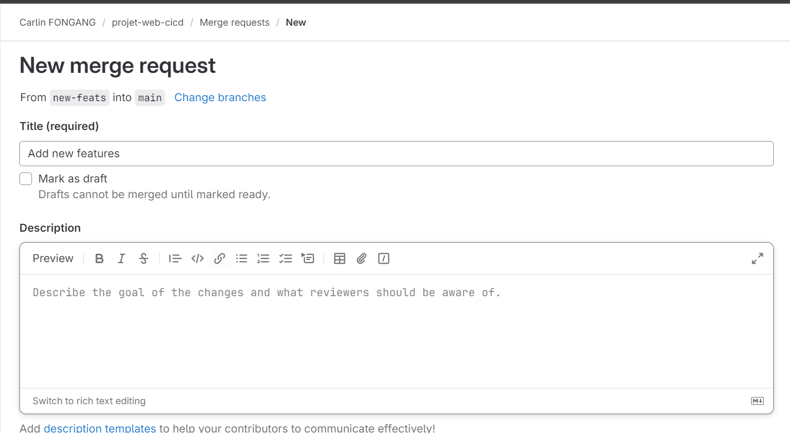
*exécution du merge_request*

>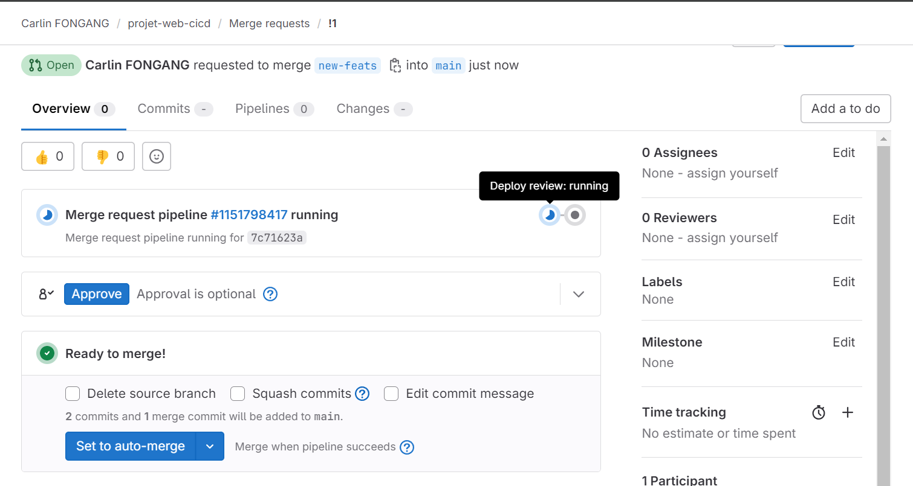
*lancement du "Deploy review"*


### 7.5. Rendu
>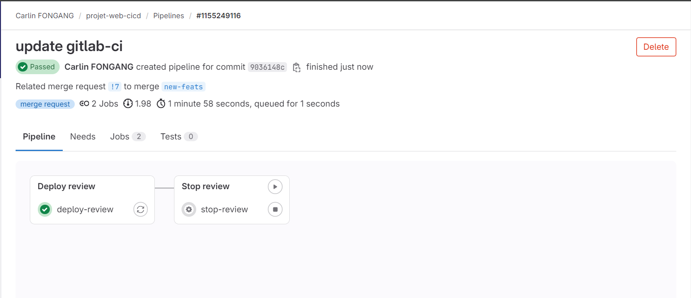
>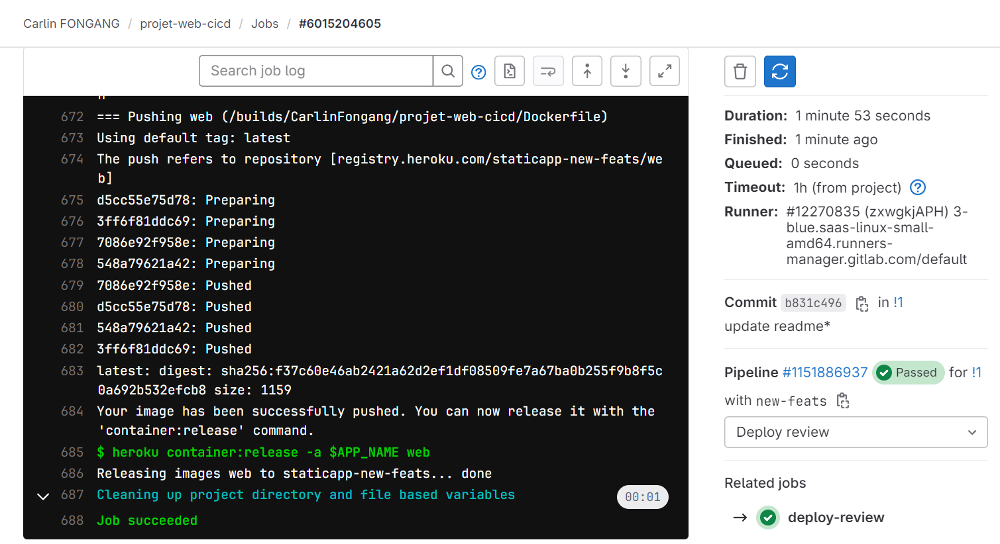

#### Rendu Application static-webapp
>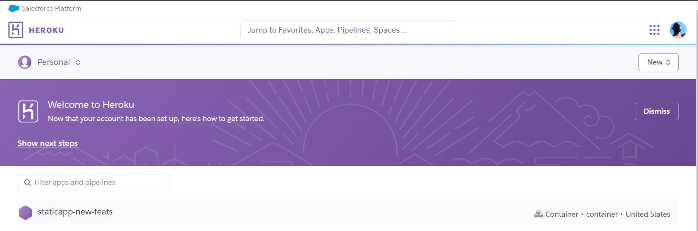
>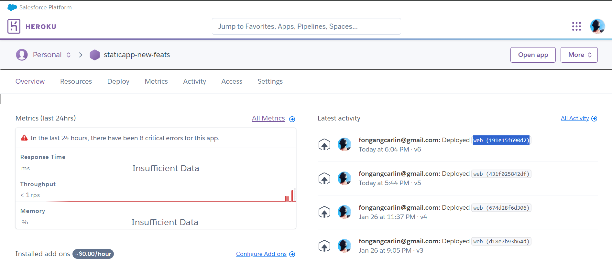
*Dashbord Heroku avec historique de déployements*

*Insérer la capture correspondante de l'application web*

## 8. stop review stage
### 8.1. Description 
Ce stage est destiné à interrompre les environnements de révision associés aux demandes de fusion (merge). Déclenché uniquement lorsqu'une demande de fusion est prête à être fusionnée manuellement, il utilise la variable `GIT_STRATEGY` définie sur `"none"` pour ignorer les opérations Git. Le script installe `npm` et l'outil `Heroku CLI`, se connecte au registre de conteneurs Heroku, puis détruit l'application Heroku correspondant à la branche fusionnée, nettoyant ainsi les ressources de manière efficace après la fusion.

>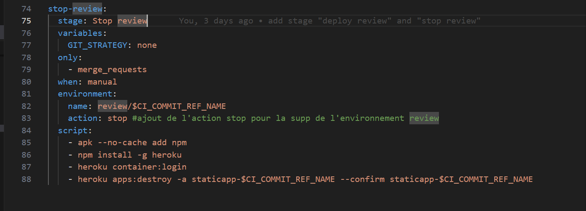
*Script de suppression de l'environnement de review après validation du merge request*

### 8.2. Explication du script
1. `stop-review`: Cette ligne déclare le nom de la phase du pipeline, dans ce cas "stop-review".

2. `stage`: Stop review: Indique que cette phase appartient à l'étape "Stop review".

3. `variables: GIT_STRATEGY: none`: Définit une variable Git, GIT_STRATEGY, avec pour valeur "none", indiquant que Git ne sera pas utilisé dans cette phase.

4. `only: - merge_requests`: Spécifie que cette phase ne sera exécutée que pour les demandes de fusion.

5. `when: manual`: Indique que l'exécution de cette phase doit être déclenchée manuellement.

6. `environment: name: review/$CI_COMMIT_REF_NAME action: stop`: Configure l'arrêt de l'environnement nommé "review/$CI_COMMIT_REF_NAME". 

### 8.3. Rendu
>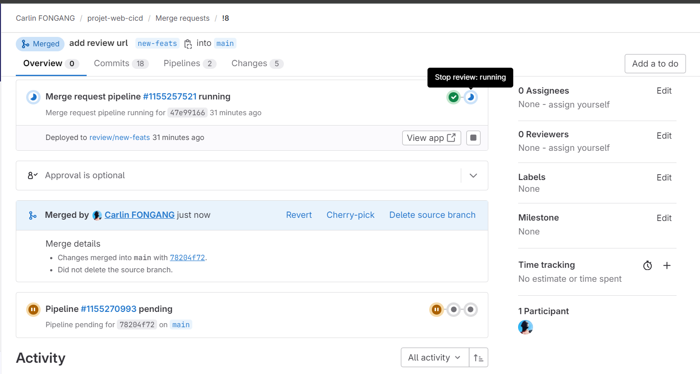
*Validation manuelle de la merge request*

>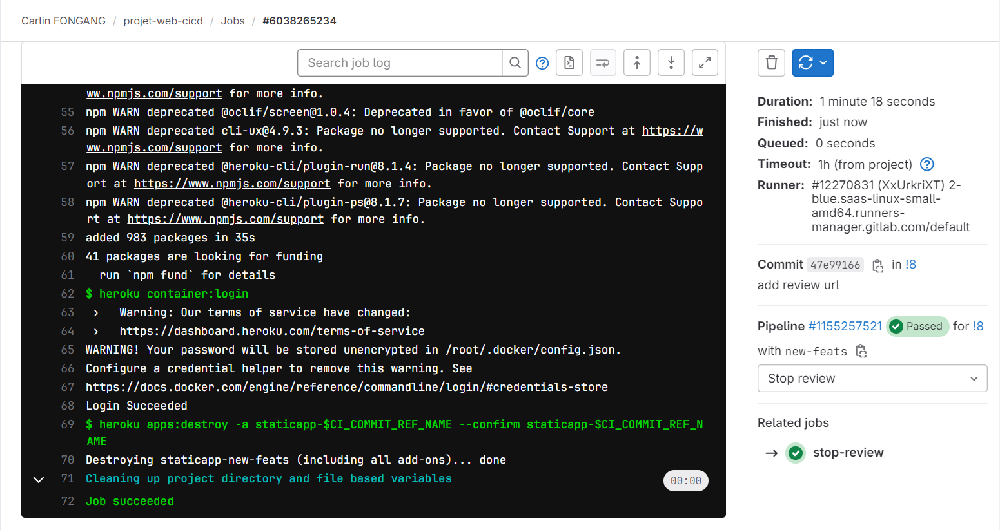
*Job successfull*

>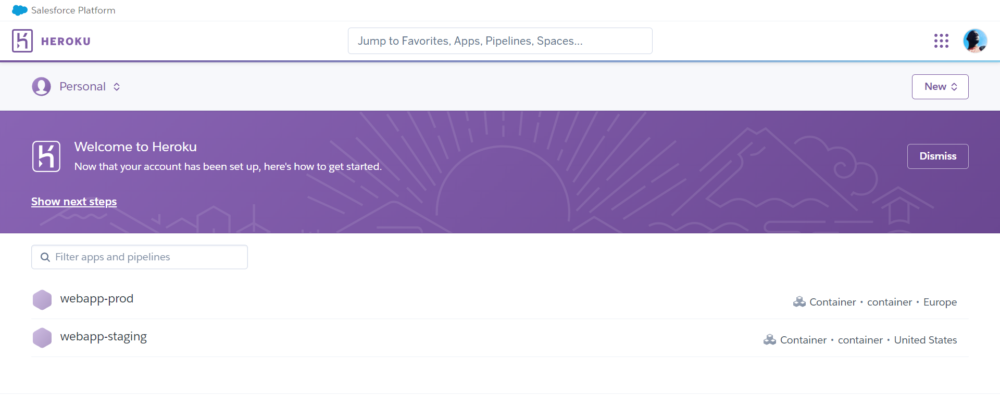
*Suppression de l'environnement staticapp-new-feats*


## 9. deploy staging
### 9.1. Description 
Le script "deploy staging" orchestre le déploiement de l'application static-webapp, basé sur l'image staticapp sur une instance EC2 AWS, représentant l'environnement de staging. L'image Docker de base utilise est Alpine, il met à jour les paquets et installe le client SSH. En utilisant SSH, il se connecte à l'instance EC2 avec les clés d'identification fournies et effectue plusieurs actions : il se connecte au registre Docker GitLab CI/CD pour télécharger l'image Docker associée à la branche actuelle (main), supprime un éventuel conteneur existant portant le nom "static-webapp" qui aurai été déployé précédement, puis lance un nouveau conteneur Docker à partir de l'image téléchargée. L'environnement "staging" est défini pour cette instance, avec une URL donnée, et le déploiement est limité à la branche principale ("main").

>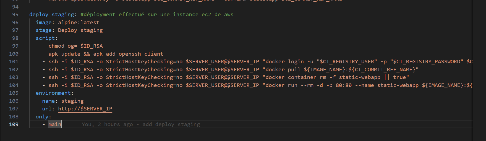
>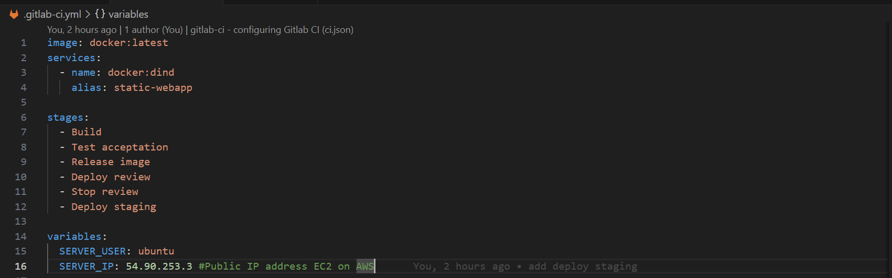

### 9.2. Explications du script
1. `deploy staging`: : Définit le nom du job de déploiement comme "deploy staging".
2. image: alpine:latest : Spécifie l'image Docker à utiliser pour exécuter le job, dans ce cas, Alpine Linux.
3. stage: Deploy staging : Indique le stade de déploiement dans le pipeline GitLab, ici "Deploy staging".
4. script: 
  - chmod og= $ID_RSA : Ajuste les permissions du fichier d'identification SSH pour que seul le propriétaire puisse y accéder.
  - apk update && apk add openssh-client : Met à jour les paquets et installe le client SSH.
  - ssh -i $ID_RSA -o StrictHostKeyChecking=no $SERVER_USER@$SERVER_IP "docker login -u "$CI_REGISTRY_USER" -p "$CI_REGISTRY_PASSWORD" $CI_REGISTRY" : Utilise SSH pour se connecter à l'instance EC2, puis se connecte au registre Docker GitLab CI/CD pour l'authentification.
  - ssh -i $ID_RSA -o StrictHostKeyChecking=no $SERVER_USER@$SERVER_IP "docker pull ${IMAGE_NAME}:${CI_COMMIT_REF_NAME}" : Télécharge l'image Docker associée à la branche actuelle depuis le registre Docker GitLab CI/CD.
  - ssh -i $ID_RSA -o StrictHostKeyChecking=no $SERVER_USER@$SERVER_IP "docker container rm -f static-webapp || true" : Supprime le conteneur Docker existant s'il porte le nom "static-webapp".
  - ssh -i $ID_RSA -o StrictHostKeyChecking=no $SERVER_USER@$SERVER_IP "docker run --rm -d -p 80:80 --name static-webapp ${IMAGE_NAME}:${CI_COMMIT_REF_NAME}" : Lance un nouveau conteneur Docker à partir de l'image téléchargée, avec le nom "static-webapp" et exposant le port 80.
5. environment: : Déclare l'environnement associé à cet déploiement.
6. only: : Indique les conditions pour exécuter ce job, dans ce cas, il ne sera exécuté que pour la branche principale ("main").

### 9.3. setup (variable)
Les variables configurées : 
Définition de l'utilisateur et l'adresse ip à utiliser pour la connexion en ssh
````
variables:
  SERVER_USER: ubuntu
  SERVER_IP: 54.90.253.3 #Public IP address EC2 on AWS
````
ID_RSA : conrespond au contenu de fichier de clé privé généré lors de la création de l'intance ec2 sur laquelle sera déployé l'application en phase de staging, bien faire attention de définir le type de variable comme fichier `"file"` 
>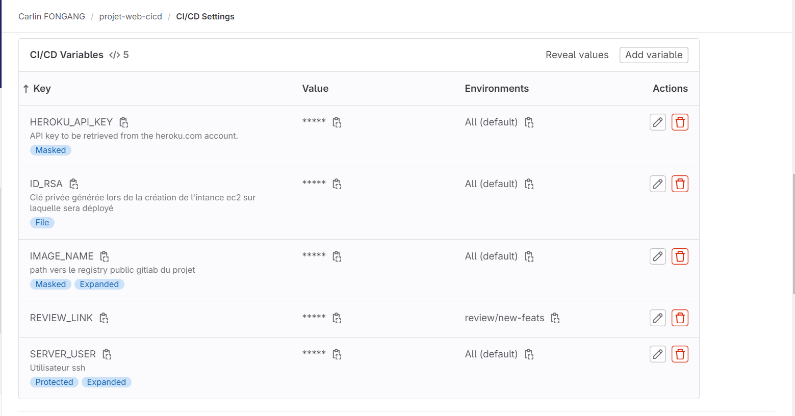


### 9.4. Rendu du déployement
Une fois le merge requeste validé pour l'ajout de nouvelles fonctionnalité à la branche principale `main`, le deploiement de l'application static-webapp est lancé en environnement de staging
>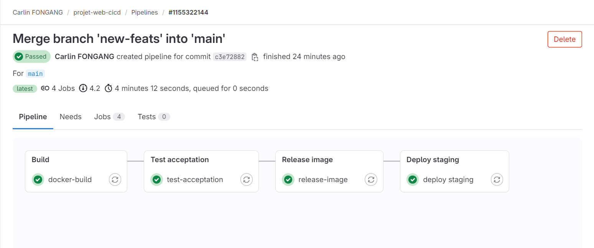
>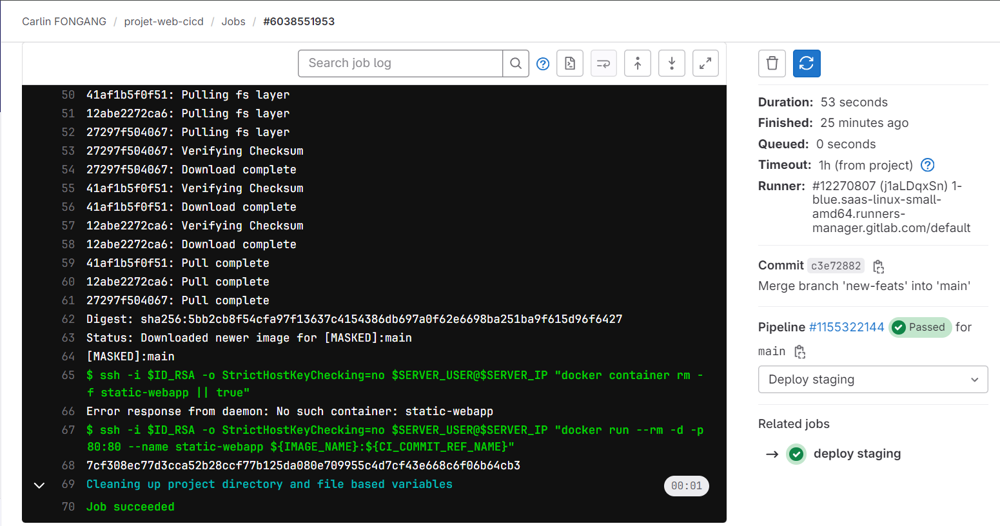

#### Rendu Application static-webapp
`http://54.90.253.3:80`
>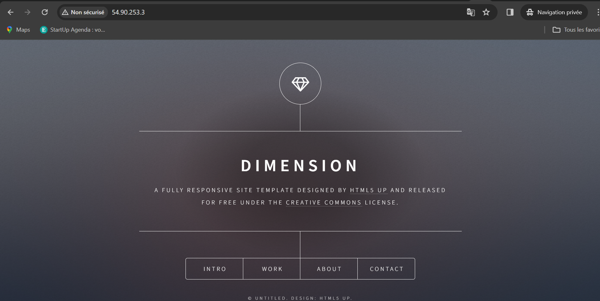


## 10. test staging
### 10.1. Description 
Ce script définit un job de test appelé "test staging" qui hérite des paramètres du job "test" précédemment défini plus haut dans le fichier .gitlab-ci.yml. Il spécifie le stade "Test staging" dans le pipeline. De plus, il surcharge une variable d'environnement "DOMAIN" avec la valeur "http://$SERVER_IP", avec "$SERVER_IP" qui une variable d'environnement définie plus haut dans le pipeline. Ce job est destiné à tester les fonctionnalités de l'application sur un environnement de staging spécifique.

>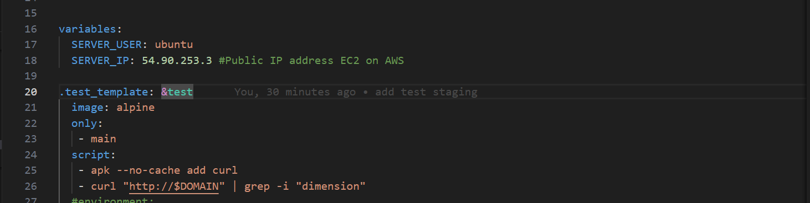
*definition du tamplete de test*
>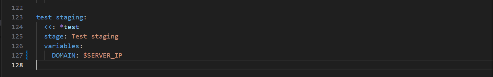
*définition du job de test en environnement de staging*

### 10.2. Explications du script
1. `test staging`: : Définit le nom du job, "test staging", qui sera affiché dans le pipeline du CI/CD.

2. `<<: *test `: Utilise l'opérateur YAML pour inclure toutes les clés et valeurs du template `"test"`, permettant de réutiliser les paramètres définis dans le template `"test"` pour ce job.

3. `stage: Test staging `: Indique le stade du pipeline auquel ce job appartient, ici "Test staging". Cette étape sera affichée dans l'interface du pipeline pour indiquer à quel moment le job est exécuté.

  - `variables:` : Déclare une section pour définir les variables spécifiques à ce job.

  - `DOMAIN: http://$SERVER_IP` : Définit une variable d'environnement appelée "DOMAIN" avec pour valeur "http:// $SERVER_IP". Ici, "$SERVER_IP" est une variable d'environnement qui sera remplacée par une adresse IP définie ailleurs dans le pipeline, et "DOMAIN" est utilisé pour définir le domaine sur lequel les tests seront exécutés.


### 10.4. Rendu
Réponse du `curl http://$DOMAIN | grep -i "dimension"`
>
>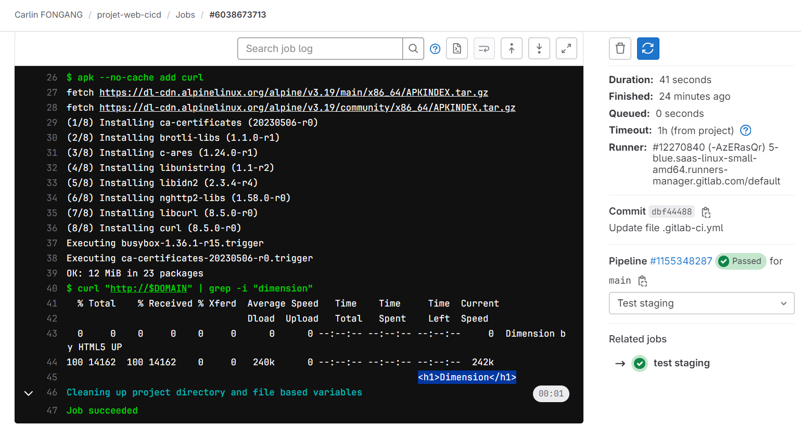
*test réussi*

noté que certains stage ont été mis en commentaire, pour accélérer le rendu du pipeline.
En environnement de production, toutes les étapes devrons être exécutées


## 11. deploy staging
### 11.1. Description 
Le déploiement en production est similaire au déploiement et test en staging ! 😊
Reprendre le déploiement en staging en y apportant quelques modifications 

### 11.4. Rendu du déployement
>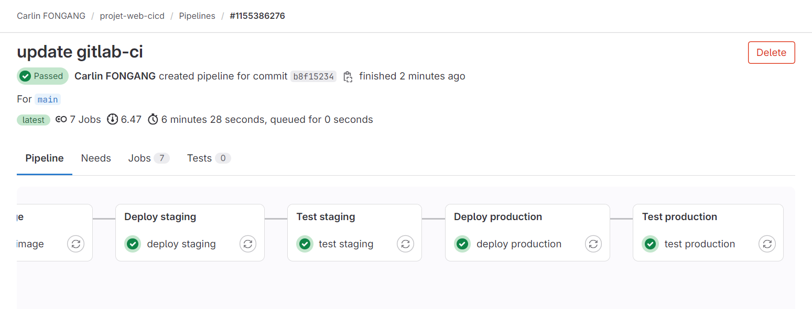
*Validation du déploiement et du test en production*
>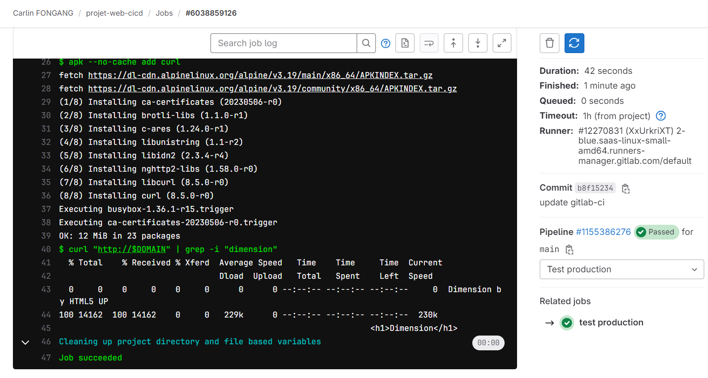
*Reponse du test en production*

#### Rendu Application webapp-prod
>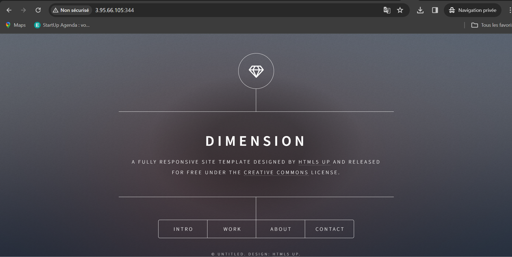
*Application disponible en production*

## 12. Ressource complémentaire 
### 12.1. Configuré un compte heroku
[visit this link to setup heroku API ant url link for you gitlab account](https://gitlab.com/CarlinFongang/lab4-deployment)

### 12.2. Mettre en place un runner privé avec gitlab-runner pour Docker
[visit this link to setup a private Docker gitlab-runner](https://gitlab.com/CarlinFongang/lab4-deployment)

# Conclusion du projet.🙌
To be continious....