# Gitlab-CI | Automate deploying a Dockerized basic web application with Gitlab CI and AWS

<p align="center">
Please find the specifications by clicking
  <a href="https://github.com/eazytraining/gitlab-ci-training/tree/2ea9e36e03909e19ceb2fae2d9d950b3dc8546e8/TPs%20Heroku/TP6%20-%20Test%20de%20validation" alt="Crédit : eazytraining.fr" >
  </a>
</p>

------------

Firstname : Carlin

Surname : FONGANG

Email : fongangcarlin@gmail.com


 

LinkedIn : https://www.linkedin.com/in/carlinfongang/

_______
## Documenting my experiments with Gitlab CI to deploy a Dockerized html application.
>

## Architecture
>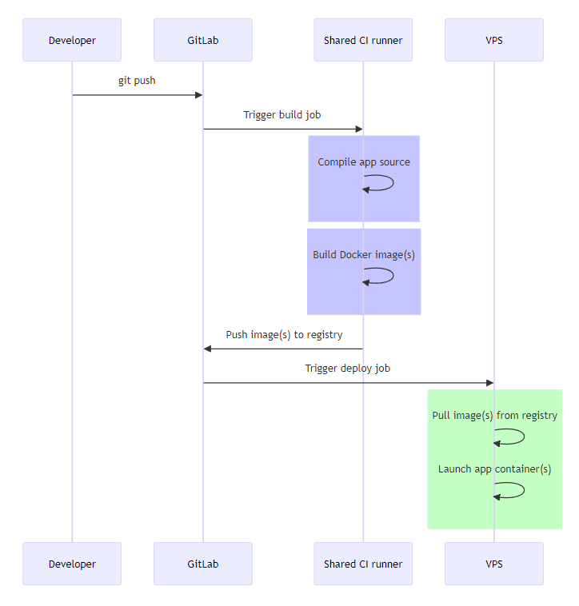

## Overview
Dans cet projet, je vais déployer un projet via une chaine CI/CD sur Gitlab, en utilisant leur suite complète d'outils pour enfin placer mon application groupée sur le serveur de production basé sur une instance EC2 de AWS.

## The Project
Un petit commentaire sur la configuration du projet. L'intention étant de mettre en exergue le déploiement en environnement de production en usant des outils tels que  Gitlab ainsi que  la configuration de docker/nginx via l'application Web static-website-example.

1. Application Web  basic qui affiche un page web static avec du contenu texte et des couleurs.
2. Serveur Web fonctionnant sur nginx.
3. Un seul conteneur Docker sans aucune couche de persistance.
4. Le serveur de production sera sur AWS, Ubuntu 22.04.
5. Gitlab pour héberger le contrôle de source, les pipelines CI et le référentiel de conteneurs.

## Intended Workflow
Lorsqu'un développeur pousse vers une branche principale ou des balises,

1. Le build de l'image du docker sera déclenchée.
2. Une nouvelle image Docker est créée et balisée.
3. Ensuite on effectura un test d'acceptance pour s'assurer du la fiabilité de l'image Docker buildé
4. L'image Docker est ensuite transférée vers le registre de conteneurs Gitlab comme release.
5. L'exécuteur de pipeline va lancer le déploiement de l'image sur l'environnement de review lors de nouvelle merge request.
6. Une fois la version en review validé, et la merge sur la branche main validé, l'étape de stop review pour la suppression de l'environnement de review sera lancée
7. Après le stop review effectué dans le pipeline, le déploiement en environnemnet de staging sera exécuté dnas le pipeline
8. Une test du staging sera ensuite exécuté pour vérifié la disponibilité de l'application en staging
9. Une fois l'étape 8. validé dans le pipeline (test staging), le deploiement en production sera exécuté
10. Enfin, un test du déploiment constituant la dernière étape du pipeline sera effectué pour validé la disponibilité de l'application en production

## 1. Dockerfile content
Déclaration du Dockerfile qui va servir au futur build du projet dans la première étape du pipeline 
>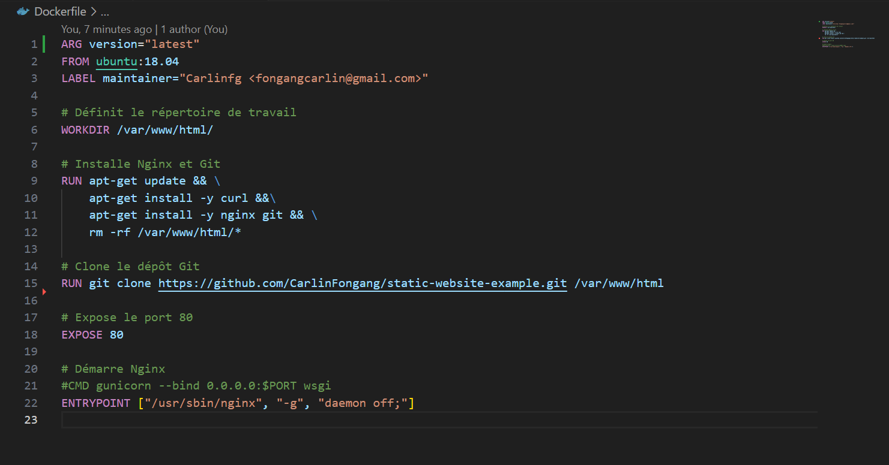

Ce Dockerfile définit les étapes nécessaires pour créer une image Docker basée sur Ubuntu 18.04, avec Nginx installé et un dépôt Git cloné pour servir un site web statique. Voici une explication point par point :

1. Utilise l'image de base Ubuntu version 18.04.
2. Ajoute une étiquette (label) "maintainer" avec l'adresse e-mail de l'auteur.
3. Définit le répertoire de travail actuel à /var/www/html/.
4. Met à jour les paquets, installe `Curl, Nginx et Git`, puis supprime le contenu existant dans `/var/www/html/`.
5. Clone le dépôt Git `https://github.com/CarlinFongang/static-website-example.git` dans `/var/www/html`.
6. Expose le port 80 pour les connexions externes.
7. Configure l'entrée principale pour démarrer Nginx en mode démon (daemon).


## Mise en place du projet Gitlab
>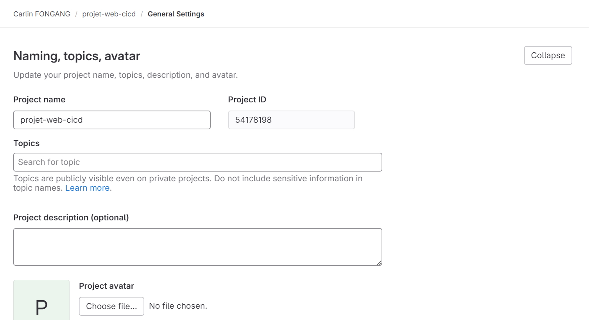
### 1. Créez un nouveau projet
Créez un nouveau projet et notez les instructions sur la façon de transmettre votre code au projet. Avant cela, assurez-vous d'avoir déjà configuré vos clés SSH pour la connextion à Gitlab depuis votre pc.

### 2. Poussez votre projet sur gitlab


````
cd projet-web-cicd
git remote add origin git@gitlab.com:user_name_on_gitlab/projet-web-cicd.git 
git add . 
git commit -m "Initial Commit" 
git push --set-upstream origin main
````

### 3. Créez un fichier .gitlab-ci.yml
Créez un fichier caché .gitlab-ci.yml et placez-le dans la repertoire racine du projet. Ceci est nécessaire pour que gitlab récupère et configure le pipeline. Une fois que gitlab aura détecté ce fichier, il attribuera des runners pour exécuter votre pipeline. Le contenu du gitlab-ci.yml est le suivant.
````
cd projet-web-cicd\
cat .gitlab-ci.yml
````
>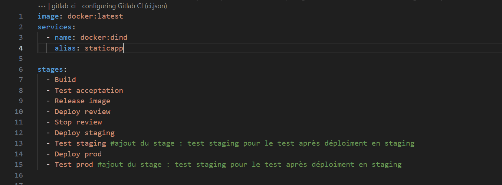

Il y a un total de 9 étapes dans notre processus de fabrication de pipeline. Défini en haut du fichier .gitlab-ci.yml
1. Build: Construction de l'image docker qui sera utilisé pour les futur déploiements.
2. Test acceptation: Exécution de tests pour valider la fiabilité de l'image builder.
3. Release image: Publication de l'image dans le registre gitlab pour une utilisation ultérieure.
4. Deploy review: Déploiement d'un environnement de review pour tester les fonctionnalités de nouvelle branche.
5. Stop review: Suppression de l'environnement de review après validation des fonctionnalités.
6. Deploy staging: Déploiement en environnement de staging pour des tests plus larges.
7. Test staging: Exécution de tests pour valider le déploiement en staging.
8. Deploy prod: Déploiement en production après validation en staging.
9. Test prod: Exécution de tests pour valider le déploiement en production.


## Setting of build stage 
dans cette étape, je fait appel directement au code depuis le repo distance 
dans le stage  docker-build, nous utilisons une image Docker pour créer une autre image Docker, vous pouvez donc voir que nous avons utilisé l'image docker:latest et comme service docker:dind.
Une fois l'image buildé, nous allons gardé le produit de cette phase sous forme d'artifact pour un usage ultérieur 
>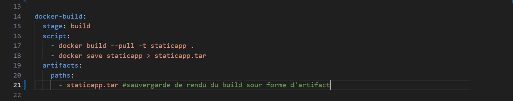
*stage build dans le gitlab-ci*

### Explications
1. `docker build --pull -t staticapp` .: Cette commande construit une image Docker à partir du Dockerfile présent dans le répertoire courant (.). L'option --pull permet de s'assurer que les images de base sont toujours à jour.

2. `docker save staticapp > staticapp.tar`: L'image Docker construite est ensuite sauvegardée sous forme d'archive tar dans le fichier staticapp.tar. Cette archive contient l'image complète, prête à être chargée ultérieurement.

3. `artifacts paths`: La dernière ligne spécifie que le fichier staticapp.tar doit être conservé comme un artifact de build. Cela signifie que ce fichier sera disponible pour les étapes ultérieures du pipeline, permettant son utilisation dans d'autres jobs ou stages.


### Résultats
>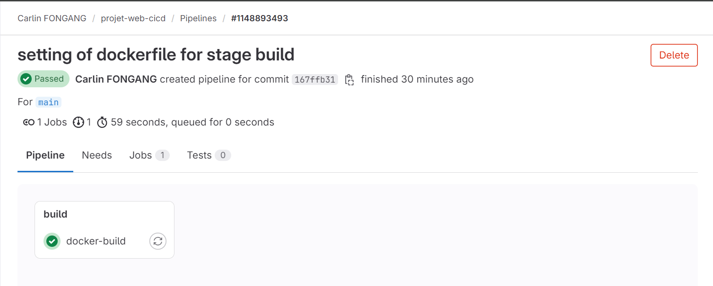
*build dans le pipeline CI/CD*

>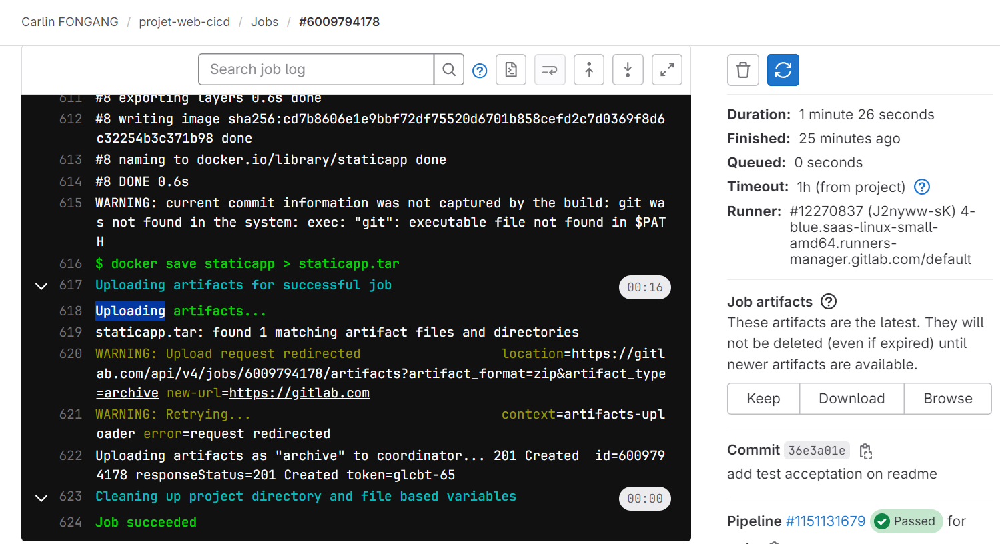


>Build > Artifacts
>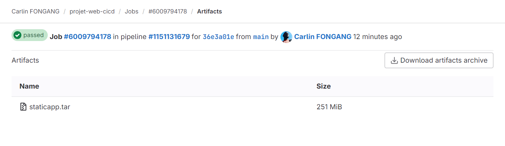
*Artifact staticapp.tar*


## Launch "test d'acceptation"
Dans le stage "test-acceptation", l'image Docker "staticapp" produit à la phase de build est chargée, et un conteneur temporaire nommé "staticapp-test" est créé à partir de cette image. Le conteneur tourne en arrière-plan sur le port 80. Un délai de 5 secondes est introduit pour permettre au conteneur de s'initialiser. Ensuite, l'utilitaire Curl est installé pour effectuer des requêtes HTTP. L'adresse IP du conteneur est obtenue à l'aide de la commande Docker inspect. 

Une requête HTTP est effectuée sur le conteneur pour vérifier la présence de la chaîne "DIMENSION". Enfin, l'adresse IP du conteneur est affichée en sortie. Ce stage vise à tester et à valider le fonctionnement de l'application statique dans un environnement isolé.
>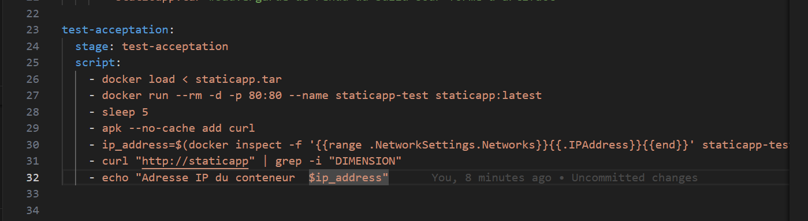

### Explication

1. `docker load < staticapp.tar`: Cette commande charge l'image Docker précédemment construite à partir du fichier staticapp.tar. Cela permet de restaurer l'image pour être utilisée dans un conteneur.

2. `docker run --rm -d -p 80:80 --name staticapp-test staticapp:latest`: Cette commande lance un conteneur détaché (-d) à partir de l'image staticapp:latest. Le conteneur est nommé staticapp-test et les ports sont mappés pour rediriger le trafic du port 80 de l'hôte vers le port 80 du conteneur.

3. `sleep 5`: Cette commande ajoute une pause de 5 secondes, permettant au conteneur de s'initialiser complètement avant de commencer les tests.

4. `apk --no-cache add curl`: Installe l'utilitaire curl dans le conteneur pour effectuer des requêtes HTTP depuis le script de test.

5. `ip_address=$(docker inspect -f '{{range .NetworkSettings.Networks}}{{.IPAddress}}{{end}}' staticapp-test)`: Extrait l'adresse IP du conteneur staticapp-test pour une utilisation ultérieure.

6. `curl "http://staticapp" | grep -i "DIMENSION"`: Effectue une requête HTTP sur le conteneur en utilisant son nom (staticapp). La réponse est ensuite filtrée pour rechercher la chaîne "DIMENSION" en ignorant la casse.

7. `echo "Adresse IP du conteneur $ip_address"`: Affiche l'adresse IP du conteneur dans la sortie du script.


### Résultats
>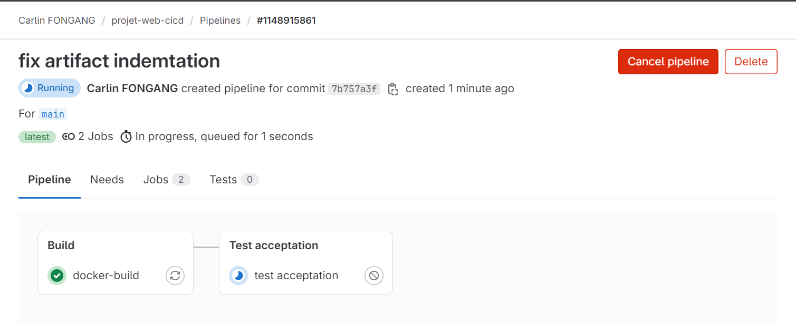
*job test_acceptation*

>
*Retour vérifiée de la requette curl*


## Release
Dans le stage "Release image", l'objectif est de préparer l'image Docker pour la mise en production. Le script commence par charger l'image préalablement construite dans l'environnement. Ensuite, deux tags sont ajoutés à cette image, correspondant au nom de la branche (CI_COMMIT_REF_NAME) et à l'identifiant court du commit (CI_COMMIT_SHORT_SHA). Ces tags permettent d'identifier de manière unique la version de l'image. Enfin, l'authentification est configurée pour le registre Docker de GitLab, et les tags sont poussés vers ce registre, rendant ainsi l'image disponible pour le déploiement ultérieur.
>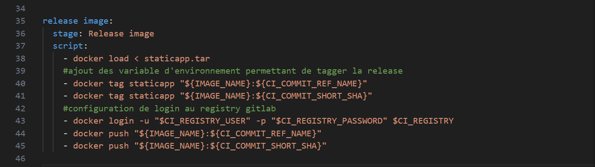

### Explications
1. `docker load < staticapp.tar`: Cette commande charge l'image Docker préalablement construite, qui est stockée dans le fichier staticapp.tar.

2. `docker tag staticapp "${IMAGE_NAME}:${CI_COMMIT_REF_NAME}"`: Deux tags sont ajoutés à l'image. Le premier tag est basé sur le nom de la branche (CI_COMMIT_REF_NAME).

3. `docker tag staticapp "${IMAGE_NAME}:${CI_COMMIT_SHORT_SHA}"`: Le deuxième tag est basé sur l'identifiant court du commit (CI_COMMIT_SHORT_SHA).

4. `docker login -u "$CI_REGISTRY_USER" -p "$CI_REGISTRY_PASSWORD" $CI_REGISTRY`: Cette commande configure l'authentification pour le registre Docker de GitLab en utilisant le nom d'utilisateur et le mot de passe fournis comme variables d'environnement.

5. `docker push "${IMAGE_NAME}:${CI_COMMIT_REF_NAME}"`: L'image, avec le tag correspondant au nom de la branche, est poussée vers le registre Docker de GitLab.

6. `docker push "${IMAGE_NAME}:${CI_COMMIT_SHORT_SHA}"`: De même, l'image avec le tag basé sur l'identifiant court du commit est également poussée vers le registre, rendant ainsi les deux versions accessibles pour le déploiement ultérieur.

### Rendu
>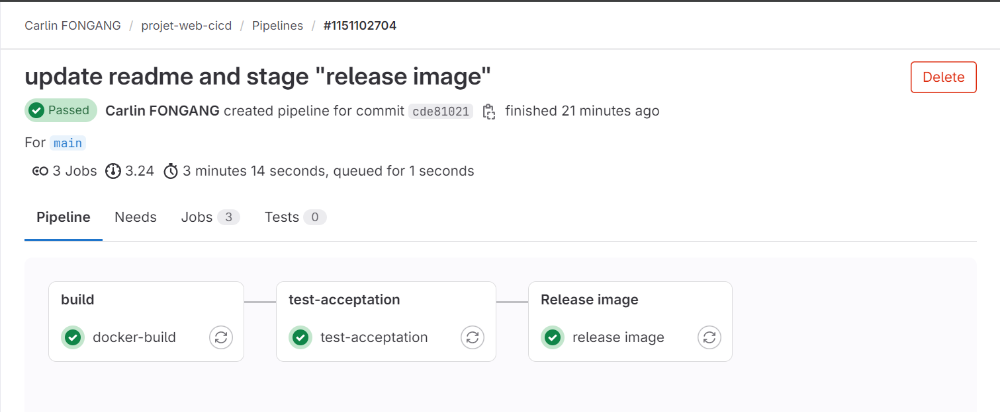
>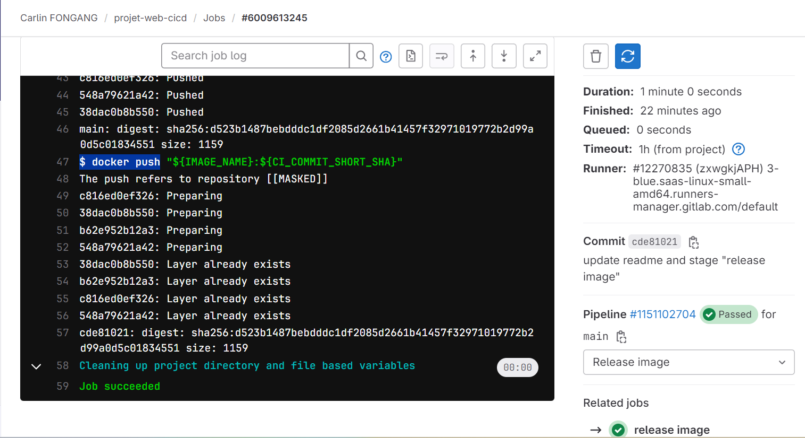
*Bon déroulement du job release*

#### Sauvegarde de la release
>Deploy > Container Registry > projet-web-cicd
>


## deploy review stage
### Description 

>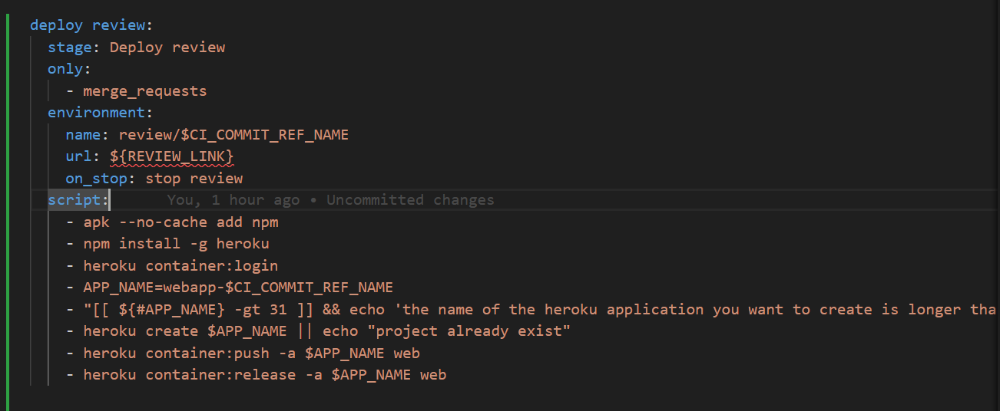
*script du stage deploy review*

### Explication


### setup (variable)
`Settings > CICD > Variables\`
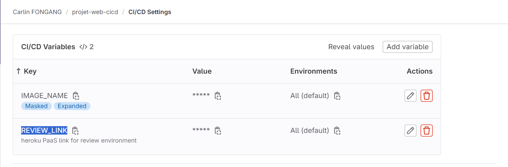
*setting variables*


### Rendu


## deploy review stage
### Description 

### Explication

### setup (variable)

### Rendu
