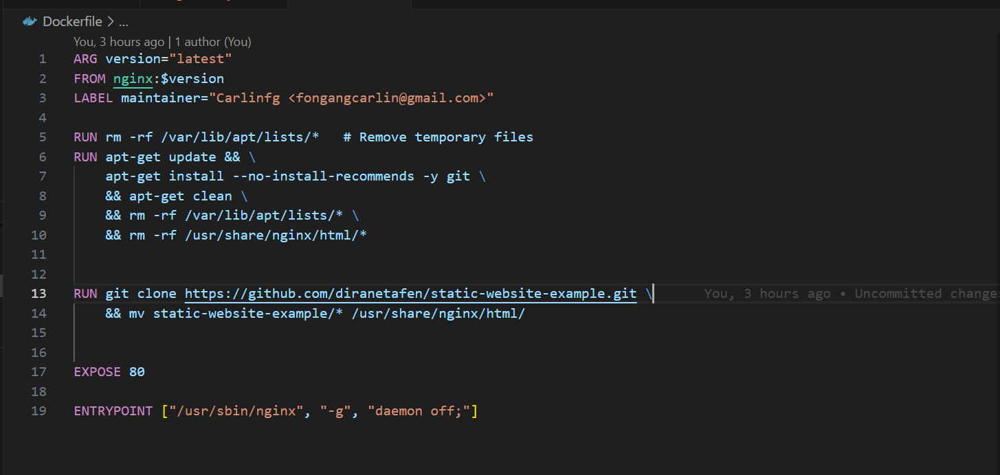
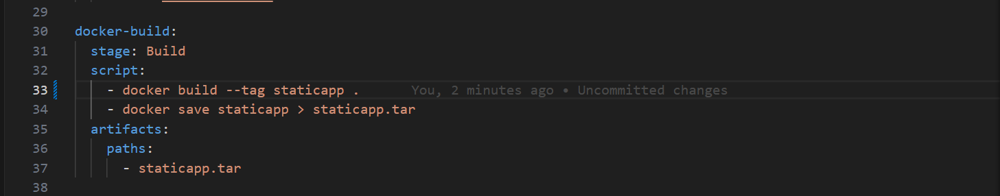
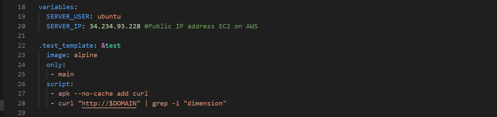

# Gitlab-CI | Automate deploying a Dockerized basic web application with Gitlab CI/CD pipeline on Heroko and AWS

[Please find the specifications by clicking](https://github.com/eazytraining/gitlab-ci-training/")

------------

Firstname : Carlin

Surname : FONGANG

Email : fongangcarlin@gmail.com


> 
>
>LinkedIn : https://www.linkedin.com/in/carlinfongang/

_______
## Documenting my experiments with Gitlab CI to deploy a Dockerized html application on aws and heroku PaaS.
>

## Architecture
>

## Overview
In this project, I will deploy an application through a CI/CD pipeline on Gitlab, utilizing their full suite of tools to ultimately place my bundled application on the production server based on an AWS EC2 instance.

## The Project
A brief comment on the project configuration. The intention is to highlight the deployment to a production environment using tools such as Gitlab, as well as the configuration of Docker/nginx via the static-website-example web application.

The project will involve:
1. A basic web application displaying a static web page with text content and colors.
2. A web server running on Nginx.
3. A Docker container for each deployment stage required.
4. The acceptance test server will be a Dyno server from Heroku.
5. The staging and production servers will be on AWS, running Ubuntu 22.04 LTS.
6. Gitlab will host the source control, CI/CD pipelines, and container repository.

## Intended Workflow
When a developer pushes to a main branch or tags:

1. The Docker image build will be triggered.
2. A new Docker image is created and tagged.
3. Subsequently, an acceptance test will be performed to ensure the reliability of the built Docker image.
4. The Docker image is then transferred to the Gitlab container registry as a release.
5. The pipeline executor will initiate the deployment of the image to the review environment during a new merge request.
6. Once the version in `review` is validated, and the merge to the `main` branch is completed, the `stop review` step for removing the review environment will be initiated.
7. After the `stop review` is completed in the pipeline, deployment to the staging environment will be executed.
8. A staging test will then be conducted to verify the availability of the application in the staging environment.
9. Once step 8 is validated in the pipeline (staging test), deployment to production will be executed.
10. Finally, a deployment test, constituting the last step of the pipeline, will be performed to validate the availability of the application in production.

## 1. Dockerfile content
Declaration of the Dockerfile that will be used for the future build of the project in the first step of the pipeline:
>

This Dockerfile defines the necessary steps to create a Docker image based on Ubuntu 18.04, with Nginx installed and a cloned Git repository to serve a static website. Here's a point-by-point explanation:

1. Uses the base image Ubuntu version 18.04.
2. Adds a "maintainer" label with the author's email address.
3. Sets the current working directory to /var/www/html/.
4. Updates packages, installs `Curl`, `Nginx`, and `Git`, then removes existing content in `/var/www/html/`.
5. Clones the Git repository `https://github.com/CarlinFongang/static-website-example.git` into `/var/www/html`.
6. Exposes port 80 for external connections.
7. Configures the main entry point to start Nginx in daemon mode.


## 3. Setting up the GitLab project
>
### 3.1. Créez un nouveau projet
Create a new project and take note of the instructions on how to push your code to the project. Before doing so, make sure you have already set up your SSH keys for connecting to Gitlab from your PC.

### 3.2. Push your project to GitLab


````
cd projet-web-cicd
git remote add origin git@gitlab.com:user_name_on_gitlab/projet-web-cicd.git 
git add . 
git commit -m "Initial Commit" 
git push --set-upstream origin main
````

### 3.3. Create a .gitlab-ci.yml file
Create a hidden file named .gitlab-ci.yml and place it in the root directory of the project. This is necessary for GitLab to retrieve and configure the pipeline. Once GitLab detects this file, it will assign runners to execute your pipeline. The content of the gitlab-ci.yml is as follows.

````
cd projet-web-cicd/
cat .gitlab-ci.yml
````
>

There are a total of 9 stages in our pipeline manufacturing process, defined at the top of the .gitlab-ci.yml file:

1. Build: Building the Docker image that will be used for future deployments.
2. Acceptance Test: Running tests to validate the reliability of the built image.
3. Release Image: Publishing the image to the GitLab registry for future use.
4. Deploy Review: Deploying a review environment to test new branch functionalities.
5. Stop Review: Removing the review environment after functionality validation.
6. Deploy Staging: Deploying to the staging environment for broader testing.
7. Staging Test: Running tests to validate the deployment in staging.
8. Deploy Production: Deploying to production after validation in staging.
9. Production Test: Running tests to validate the deployment in production.


## 4. Setting of build stage 
In this step, I directly access the code from the remote repository. In the docker-build stage, we utilize a Docker image to create another Docker image, so you can see that we used the docker:latest image and the docker:dind service. Once the image is built, we will keep the output of this phase as an artifact for future use.
>
*stage build dans le gitlab-ci*

### 4.1. Explanations
1. `docker build --tag staticapp .`: This command builds a Docker image from the Dockerfile present in the current directory (.). The --pull option ensures that the base images are always up to date.

2. `docker save staticapp > staticapp.tar`: The built Docker image is then saved as a tar archive in the file staticapp.tar. This archive contains the complete image, ready to be loaded later.

3. `artifacts paths`: The last line specifies that the staticapp.tar file should be kept as a build artifact. This means that this file will be available for subsequent steps of the pipeline, allowing its use in other jobs or stages.


### 4.2. Results
>
*build dans le pipeline CI/CD*

>


>Build > Artifacts
>
*Artifact staticapp.tar*


## 5. Launch "test d'acceptation"
In the "test-acceptance" stage, the Docker image "staticapp" produced in the build phase is loaded, and a temporary container named "staticapp-test" is created from this image. The container runs in the background on port 80. A delay of 5 seconds is introduced to allow the container to initialize. Then, the Curl utility is installed to perform HTTP requests. The container's IP address is obtained using the Docker inspect command.

An HTTP request is made to the container to check for the presence of the string "DIMENSION". Finally, the container's IP address is displayed as output. This stage aims to test and validate the functionality of the static application in an isolated environment.
>

### 5.1. Explanations

1. `docker load < staticapp.tar`: This command loads the previously built Docker image from the staticapp.tar file. This restores the image to be used within a container.

2. `docker run --rm -d -p 80:80 --name staticapp-test staticapp:latest`: This command launches a detached container (-d) from the staticapp:latest image. The container is named staticapp-test, and ports are mapped to redirect traffic from port 80 on the host to port 80 on the container.

3. `sleep 5`: This command adds a 5-second pause, allowing the container to fully initialize before starting tests.

4. `apk --no-cache add curl`: Installs the curl utility in the container to perform HTTP requests from the test script.

5. `ip_address=$(docker inspect -f '{{range .NetworkSettings.Networks}}{{.IPAddress}}{{end}}' staticapp-test)`: Extracts the IP address of the staticapp-test container for later use.

6. `curl "http://staticapp" | grep -i "DIMENSION"`: Makes an HTTP request to the container using its name (staticapp). The response is then filtered to search for the "DIMENSION" string, ignoring case.

7. `echo "Adresse IP du conteneur $ip_address"`: Displays the container's IP address in the script's output.


### 5.2. Results
>
*job test_acceptation*

>
*Response verified from the curl request.*


## 6. Release
In the "Release image" stage, the objective is to prepare the Docker image for production deployment. The script starts by loading the previously built image into the environment. Then, two tags are added to this image, corresponding to the branch name (`CI_COMMIT_REF_NAME`) and the short commit ID (`CI_COMMIT_SHORT_SHA`). These tags uniquely identify the version of the image. Finally, authentication is configured for the GitLab Docker registry, and the tags are pushed to this registry, making the image available for subsequent deployment.
>

### 6.1. Explanations
1. `docker load < staticapp.tar`: This command loads the previously built Docker image, which is stored in the staticapp.tar file.

2. `docker tag staticapp "${IMAGE_NAME}:${CI_COMMIT_REF_NAME}"`: Two tags are added to the image. The first tag is based on the branch name (CI_COMMIT_REF_NAME).

3. `docker tag staticapp "${IMAGE_NAME}:${CI_COMMIT_SHORT_SHA}"`: The second tag is based on the short commit ID (CI_COMMIT_SHORT_SHA).

4. `docker login -u "$CI_REGISTRY_USER" -p "$CI_REGISTRY_PASSWORD" $CI_REGISTRY`: This command configures authentication for the GitLab Docker registry using the provided username and password as environment variables.

5. `docker push "${IMAGE_NAME}:${CI_COMMIT_REF_NAME}"`: The image, with the tag corresponding to the branch name, is pushed to the GitLab Docker registry.

6. `docker push "${IMAGE_NAME}:${CI_COMMIT_SHORT_SHA}"`: Similarly, the image with the tag based on the short commit ID is also pushed to the registry, making both versions accessible for subsequent deployment.

### 6.2. Results
>
>
*Successful execution of the release job*

#### Sauvegarde de la release
>Deploy > Container Registry > projet-web-cicd
>


## 7. Deploy review stage
### 7.1. Description 
In the "Deploy review" stage, the pipeline is triggered only during merge requests. A Heroku application (PaaS) is created for each branch under review, in our case, it's the `new-feats` branch, using containers for deployment. The process includes installing `npm`, configuring access to the `Heroku registry`, creating the application based on the branch, deploying the containers, and finally, putting the application into production on Heroku. This allows for distinct environments for each branch under review, with a review environment URL available for branch-specific testing. A clean shutdown of the review environment is performed upon successful merging into the main branch `main`.
>
*script du stage "deploy review"*


### 7.2. Explanations 
1. `apk --no-cache add npm`: Installs the npm package manager required for project dependencies.

2. `npm install -g heroku`: Installs the Heroku command-line tool globally to facilitate Heroku operations.

3. `heroku container:login`: Authenticates the user to the Heroku container registry, enabling subsequent deployment.

4. `APP_NAME=staticapp-$CI_COMMIT_REF_NAME`: Sets the name of the Heroku application based on the current branch.

5. `[[ ${#APP_NAME} -gt 31 ]] && echo 'the name of the heroku application you want to create is longer than 30 characters' && exit 1`: Checks the length of the Heroku application name and stops the script if it exceeds the allowed limit (30 characters on Heroku).

6. `heroku create $APP_NAME || echo "project already exist"`: Creates the Heroku application with the previously defined name, avoiding an error if the project already exists.

7. `heroku container:push -a $APP_NAME web`: Pushes container images to the created Heroku application, ready for deployment.

8. `heroku container:release -a $APP_NAME web`: Deploys the application to Heroku by releasing the previously pushed containers into production.

### 7.3. Setup (variable)
`Settings > CICD > Variables`
>
*setting variables*

#### How to setup Heroku API and link to deploy envoronment
[visit this link to setup heroku API ant url link for you gitlab account](https://gitlab.com/CarlinFongang/lab4-deployment)


### 7.4. Setup a new branch in a same project
1. Create a new branch ensuring to clone the content from the main branch.
2. Switch to this new branch and make a commit.
3. Then, proceed to create a merge request to trigger the execution of the "Deploy review" stage.
>
*exécution du merge_request*

>
*Initiating "Deploy review"*


### 7.5. Results
>
>

#### Rendu Application static-webapp
>
>
*Heroku Dashboard with Deployment History*

*Insert the corresponding screenshot of the web application*

## 8. Stop review stage
### 8.1. Description 
This stage is intended to terminate the review environments associated with merge requests. Triggered only when a merge request is ready to be manually merged, it uses the `GIT_STRATEGY` variable set to `"none"` to ignore Git operations. The script installs `npm` and the `Heroku CLI` tool, connects to the Heroku container registry, and then destroys the Heroku application corresponding to the merged branch, effectively cleaning up resources after the merge.

>
*Script for deleting the review environment after merge request validation*

### 8.2. Explanations
1. `stop-review`: This line declares the name of the pipeline stage, in this case, "stop-review".

2. `stage`: Stop review: Indicates that this stage belongs to the "Stop review" step.

3. `variables: GIT_STRATEGY: none`: Defines a Git variable, GIT_STRATEGY, with a value of "none", indicating that Git will not be used in this stage.

4. `only: - merge_requests`: Specifies that this stage will only be executed for merge requests.

5. `when: manual`: Indicates that the execution of this stage must be triggered manually.

6. `environment: name: review/$CI_COMMIT_REF_NAME action: stop`: Configures the termination of the environment named "review/$CI_COMMIT_REF_NAME".


### 8.3. Results
>
*Manual validation of the merge request*

>
*Job successfull*

>
*Removing the staticapp-new-feats environment*


## 9. Deploy staging
### 9.1. Description 
The "deploy staging" script orchestrates the deployment of the static-webapp application, based on the staticapp image, on an AWS EC2 instance representing the staging environment. The base Docker image used is Alpine. It updates packages and installs the SSH client. Using SSH, it connects to the EC2 instance with the provided identity keys and performs several actions: it connects to the GitLab CI/CD Docker registry to download the Docker image associated with the current branch (main), removes any existing container named "static-webapp" that may have been previously deployed, then launches a new Docker container from the downloaded image. The "staging" environment is defined for this instance, with a given URL, and deployment is limited to the main branch ("main").

>
>

### 9.2. Explanations
1. `deploy staging`: Defines the name of the deployment job as "deploy staging".
2. image: alpine:latest: Specifies the Docker image to use for running the job, in this case, Alpine Linux.
3. stage: Deploy staging: Indicates the deployment stage in the GitLab pipeline, here "Deploy staging".
4. script:
    Here are the explanations for each line of the script:

 - 
 ````
 chmod og= $ID_RSA
 ````
  This command changes the permissions of the file represented by the variable $ID_RSA by removing access permissions for groups and other users. This can be used to secure SSH private keys.

 - 
 ````
 apk update && apk add openssh-client
 ````
  These commands update the apk package repositories and install the OpenSSH client in the Alpine Linux image. The OpenSSH client is required for connecting to SSH servers.

 - 
 ````
 ssh -i $ID_RSA -o StrictHostKeyChecking=no $SERVER_USER@$SERVER_IP "docker login -u "$CI_REGISTRY_USER" -p "$CI_REGISTRY_PASSWORD" $CI_REGISTRY"
 ````
 This line uses SSH to connect to a remote server specified by $SERVER_IP with the user $SERVER_USER, using the private key defined by $ID_RSA. Then, it executes a Docker command to authenticate to a Docker registry ($CI_REGISTRY) using the credentials specified by the environment variables $CI_REGISTRY_USER and $CI_REGISTRY_PASSWORD.

 - 
 ````
 ssh -i $ID_RSA -o StrictHostKeyChecking=no $SERVER_USER@$SERVER_IP "docker pull ${IMAGE_NAME}:${CI_COMMIT_REF_NAME}"
 ````
  This line uses SSH to connect to the remote server and executes a Docker command to pull a Docker image specified by ${IMAGE_NAME}:${CI_COMMIT_REF_NAME} from a Docker registry. This retrieves the latest version of the image for deployment.

 - 
 ````
 ssh -i $ID_RSA -o StrictHostKeyChecking=no $SERVER_USER@$SERVER_IP "docker container rm -f static-webapp || true"
 ````
 This line uses SSH to connect to the remote server and removes the Docker container named "static-webapp" if it exists. The "|| true" ensures that the command will not fail if the container does not exist.

 - 
 ````
 ssh -i $ID_RSA -o StrictHostKeyChecking=no $SERVER_USER@$SERVER_IP "docker run --rm -d -p 344:80 --name static-webapp ${IMAGE_NAME}:${CI_COMMIT_REF_NAME}"
 ```` 
 This line uses SSH to connect to the remote server and executes a Docker command to start a new Docker container named "static-webapp" from the image specified by ${IMAGE_NAME}:${CI_COMMIT_REF_NAME}. The container is started in detached mode (-d) and exposes port 80 of the container on port 344 of the host machine.
    

5. environment: Declares the environment associated with this deployment.
6. only: Indicates the conditions to run this job, in this case, it will only be executed for the main branch.

### 9.3. Setup (variable)
The configured variables:
Definition of the user and the IP address to use for SSH connection.
````
variables:
  SERVER_USER: ubuntu
  SERVER_IP: 54.90.253.3 #Public IP address EC2 on AWS
````
`ID_RSA`: corresponds to the content of the private key file generated during the creation of the EC2 instance on which the application will be deployed in the staging phase. Be sure to define the variable type as a file `"file"`.
>


### 9.4. Results
Once the merge request for adding new features to the main branch `main` is approved, the deployment of the static-webapp application is initiated in the staging environment.
>
>

#### Results of static-webapp application 
`http://54.90.253.3:80`
>


## 10. Test staging
### 10.1. Description 
This script defines a test job named "test staging" that inherits parameters from the "test" job previously defined higher up in the .gitlab-ci.yml file. It specifies the "Test staging" stage in the pipeline. Additionally, it overrides an environment variable "DOMAIN" with the value "http://$SERVER_IP", where "$SERVER_IP" is an environment variable defined earlier in the pipeline. This job is intended to test the application's features on a specific staging environment.

>
*definition du tamplete de test*
>
*définition du job de test en environnement de staging*

### 10.2. Explanations
1. `test staging`: Defines the name of the job, "test staging", which will be displayed in the CI/CD pipeline.

2. `<<: *test`: Uses the YAML operator to include all keys and values from the "test" template, allowing reuse of the parameters defined in the "test" template for this job.

3. `stage: Test staging`: Indicates the stage of the pipeline to which this job belongs, here "Test staging". This stage will be displayed in the pipeline interface to indicate when the job is executed.

   - `variables:`: Declares a section to define variables specific to this job.

   - `DOMAIN: http://$SERVER_IP`: Defines an environment variable named "DOMAIN" with a value of "http://$SERVER_IP". Here, "$SERVER_IP" is an environment variable that will be replaced by an IP address defined elsewhere in the pipeline, and "DOMAIN" is used to specify the domain on which the tests will be executed.


### 10.4. Results
Réponse du `curl http://$DOMAIN | grep -i "dimension"`
>
>
*test réussi*

Note that some stages have been commented out to speed up the pipeline rendering. In the production environment, all stages will need to be executed.


## 11. Deploy staging
### 11.1. Description 
Production deployment is similar to staging deployment and testing! 😊
We'll proceed with the staging deployment, making a few modifications along the way.

### 11.4. Results of deployment
>
*Validation du déploiement et du test en production*
>
*Reponse du test en production*

#### Results of webapp-prod application
>
*Application disponible en production*

## 12. Additional resource
### 12.1. Set up a Heroku account
[visit this link to setup heroku API ant url link for you gitlab account](https://gitlab.com/CarlinFongang/lab4-deployment)

### 12.2. Set up a private runner with GitLab Runner for Docker
[visit this link to setup a private Docker gitlab-runner](https://gitlab.com/CarlinFongang/lab4-deployment)

# Conclusion of the project.🙌
To be continious....